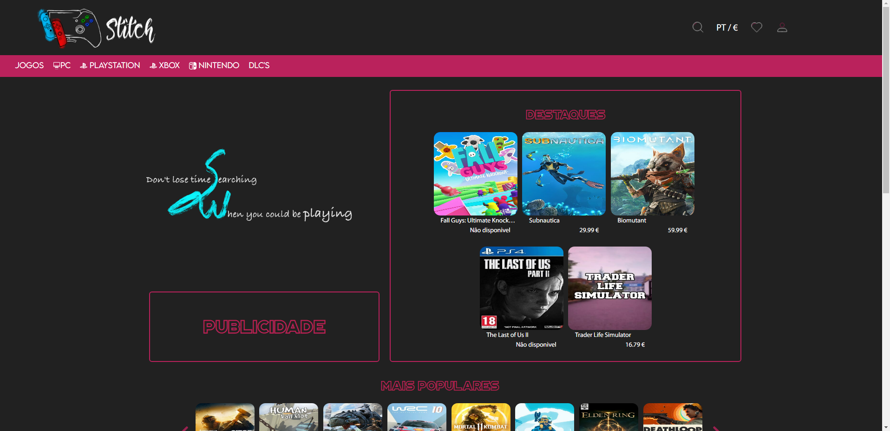
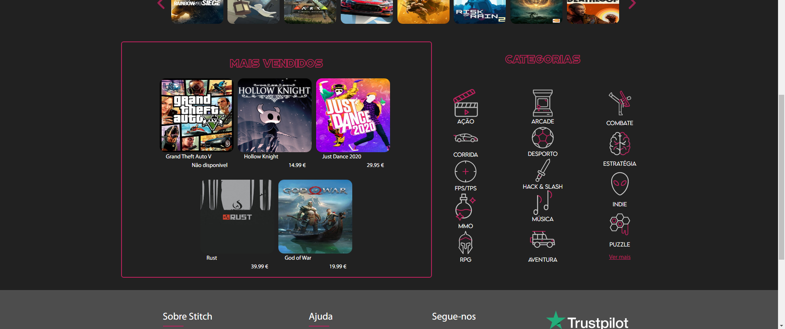
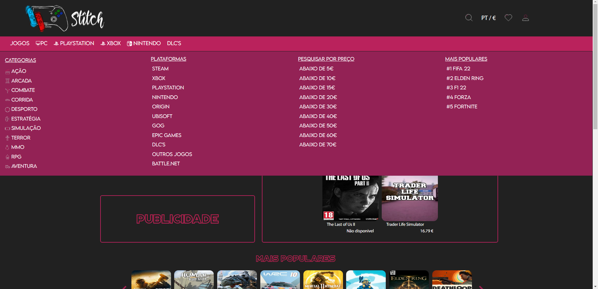
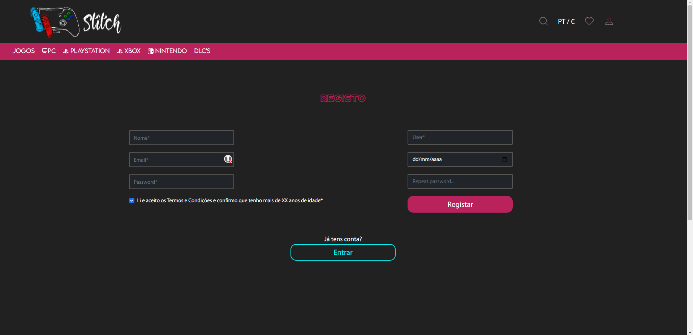
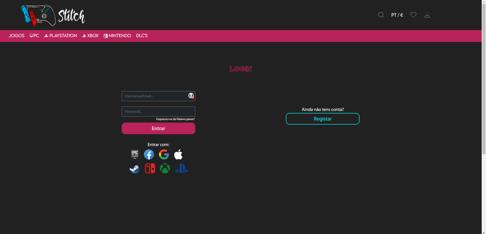
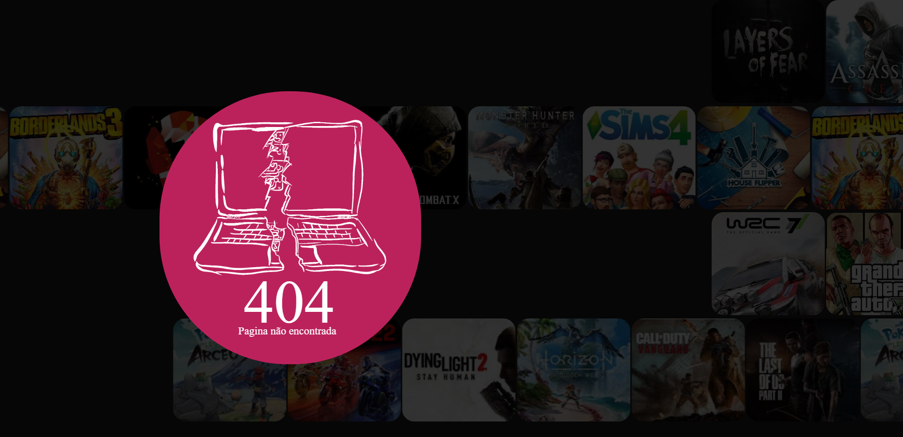
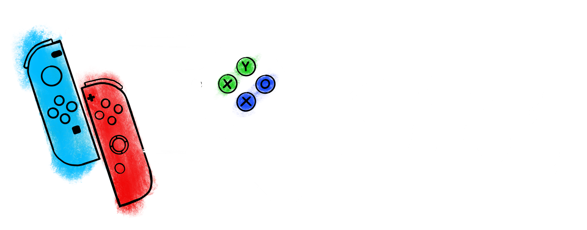
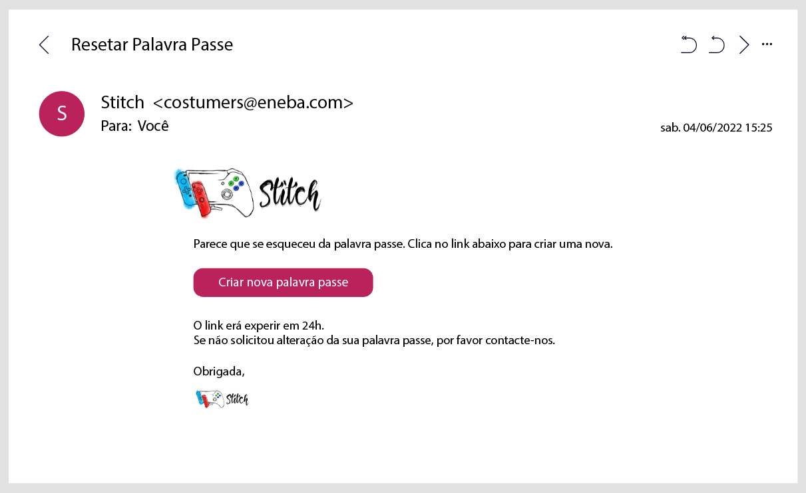

# Stitch

This was the final project of the Web Design course that I finished in 2022.
The goal was to create a website idea and put it into practice. In this website, the user can search for games from all the platforms, and find the best price in the shortest time possible. The objective is benefit the user and allow him to play as much as possible instead of wasting time looking for the best price in the market.  
I created all the design in the Adobe Illustrator, mockups and wireframes in desktop/mobile versions and made some animations on Adobe XD. After that I put it in code. 
 
I made the logo in Procreate, along with the slogan that I also animated.
 

## Home Page

### Drop down menu

# Sign up
The user can create an account, sign up with Google or Steam for example. Can also put the games in a favorites list, and receive notifications of prices changes.

# Sign in

# 404 error page

# Logo

# Slogan

# Email to recover password

[//]: # '# Video (Sorry about that, but we can’t show files that are this big right now.)'
[//]: # 'In the video above, you can see how the website works.'
[//]: # ''
